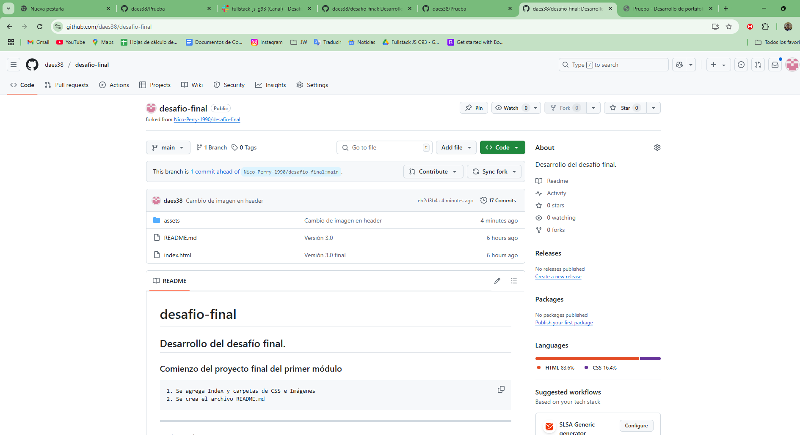

# Examen_1

  *Proyecto final Modulo 1 Desafio Latam*  

- Mi cv: 
  
  * Link: [Pagina web](https://daes38.github.io/Prueba/)
  * Image:
  

- Forks:

  *Fork 1*
  * Link: [Fork a Repositorio de Sasha Godoy](https://github.com/daes38/Cv-Sasha-Godoy)
  * Image:
  

  *Fork 2*
  * Link: [Fork a Repositorio de Nico Perry](https://github.com/daes38/desafio-final)
  * Image:
  

- Commits:
   
   *Commit 1*
  * Link: [Cambio de color de fondo por un color Pink](https://github.com/daes38/Cv-Sasha-Godoy/commit/6af31a0862b93030ea1a290c9313347ff8d4a1ef)
  * Image:
  

  *Commit 2*
  * Link: [Cambio de imagen en header](https://github.com/daes38/desafio-final/commit/eb2d3b4278f4c105a1dc5641edb3858181df8f0d)
  * Image:
  
